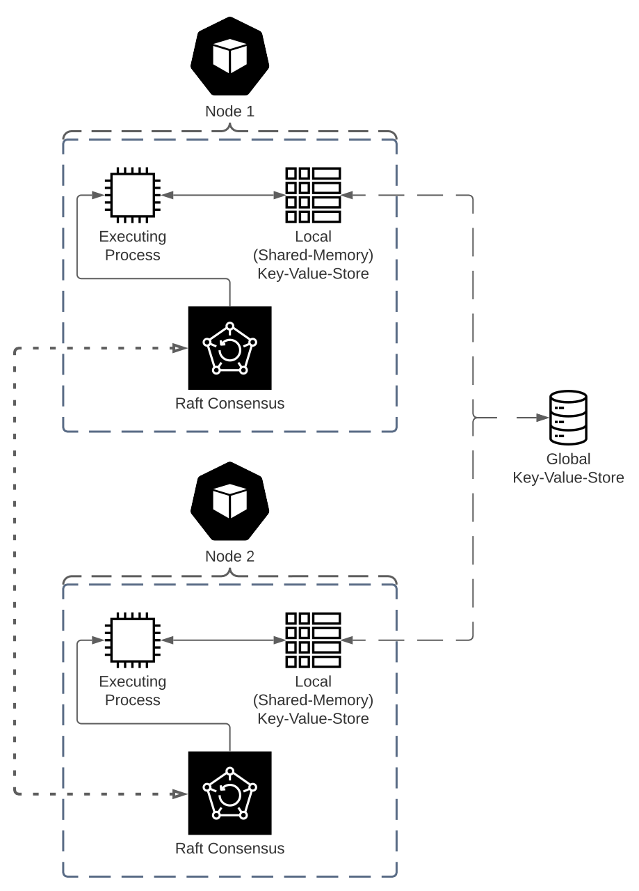

<p align="center"></p>

## Demo
Considering a single host cluster, running completely within a single PC, on separate ports, with the following specifications:
- Glocal/dstore IP Address: [::1]:50051
- Local/Node IP Address: [::1]:50052

The system can be setup and operated as follows.
1. To start the system, please setup dstore and queue to run on a background terminal:
```shell
cargo run --bin dstore -- [::1]:50051
```
2. Initialize the dstore queue with processes:
```shell
cargo run --bin unroll -- [::1]:50051
```
3. Run a node to use a single thread and render each pixel, pushing results back into dstore:
```shell
cargo run --bin node -- [::1]:50051 [::1]:50052
```
4. Collect the results from dstore and output an image:
```shell
cargo run --bin collect -- [::1]:50051 [::1]:50052
```

One can also do this with the release binaries, using commands like `./node` instead of `cargo run --bin node --`. This may give improved results considering the binaries are optimized.